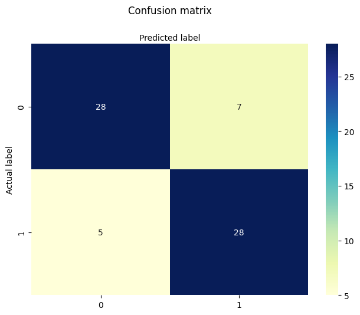

```python
# import the needed libraries
import kagglehub
import pandas as pd
import os, glob
from sklearn.linear_model import LogisticRegression
from sklearn.model_selection import train_test_split
from sklearn import metrics
import numpy as np
import matplotlib.pyplot as plt
import seaborn as sns
from sklearn.metrics import accuracy_score
```

# Load the dataset

For this project, I trying to use 2 different dataset for training and testing
- For trainning, I used dataset from Kaggle to train the model and using Hugging face dataset to evaluate it performance


```python
# Load the dataset directory
dataset_dir = kagglehub.dataset_download("neurocipher/heartdisease")
print("Dataset directory:", dataset_dir)
# hugging face dataset
df_hugging_face = pd.read_csv("hf://datasets/buio/heart-disease/heart.csv")
# Find CSV files inside it
csv_files = glob.glob(os.path.join(dataset_dir, "**", "*.csv"), recursive=True)
print("CSV files found:", csv_files)

# Read one (pick the right one if there are multiple)
df_kaggle = pd.read_csv(csv_files[0])
```

    Using Colab cache for faster access to the 'heartdisease' dataset.
    Dataset directory: /kaggle/input/heartdisease
    CSV files found: ['/kaggle/input/heartdisease/Heart_Disease_Prediction.csv']


```python

```

# Overview of the dataset

## Quick oganize and analysis


```python
df_kaggle.head()
```


  <div id="df-b37d1c66-fc80-4600-a156-2f7e84579607" class="colab-df-container">
    <div>
<style scoped>
    .dataframe tbody tr th:only-of-type {
        vertical-align: middle;
    }

    .dataframe tbody tr th {
        vertical-align: top;
    }

    .dataframe thead th {
        text-align: right;
    }
</style>
<table border="1" class="dataframe">
  <thead>
    <tr style="text-align: right;">
      <th></th>
      <th>Age</th>
      <th>Sex</th>
      <th>Chest pain type</th>
      <th>BP</th>
      <th>Cholesterol</th>
      <th>FBS over 120</th>
      <th>EKG results</th>
      <th>Max HR</th>
      <th>Exercise angina</th>
      <th>ST depression</th>
      <th>Slope of ST</th>
      <th>Number of vessels fluro</th>
      <th>Thallium</th>
      <th>Heart Disease</th>
    </tr>
  </thead>
  <tbody>
    <tr>
      <th>0</th>
      <td>70</td>
      <td>1</td>
      <td>4</td>
      <td>130</td>
      <td>322</td>
      <td>0</td>
      <td>2</td>
      <td>109</td>
      <td>0</td>
      <td>2.4</td>
      <td>2</td>
      <td>3</td>
      <td>3</td>
      <td>Presence</td>
    </tr>
    <tr>
      <th>1</th>
      <td>67</td>
      <td>0</td>
      <td>3</td>
      <td>115</td>
      <td>564</td>
      <td>0</td>
      <td>2</td>
      <td>160</td>
      <td>0</td>
      <td>1.6</td>
      <td>2</td>
      <td>0</td>
      <td>7</td>
      <td>Absence</td>
    </tr>
    <tr>
      <th>2</th>
      <td>57</td>
      <td>1</td>
      <td>2</td>
      <td>124</td>
      <td>261</td>
      <td>0</td>
      <td>0</td>
      <td>141</td>
      <td>0</td>
      <td>0.3</td>
      <td>1</td>
      <td>0</td>
      <td>7</td>
      <td>Presence</td>
    </tr>
    <tr>
      <th>3</th>
      <td>64</td>
      <td>1</td>
      <td>4</td>
      <td>128</td>
      <td>263</td>
      <td>0</td>
      <td>0</td>
      <td>105</td>
      <td>1</td>
      <td>0.2</td>
      <td>2</td>
      <td>1</td>
      <td>7</td>
      <td>Absence</td>
    </tr>
    <tr>
      <th>4</th>
      <td>74</td>
      <td>0</td>
      <td>2</td>
      <td>120</td>
      <td>269</td>
      <td>0</td>
      <td>2</td>
      <td>121</td>
      <td>1</td>
      <td>0.2</td>
      <td>1</td>
      <td>1</td>
      <td>3</td>
      <td>Absence</td>
    </tr>
  </tbody>
</table>
</div>
    <div class="colab-df-buttons">

  <div class="colab-df-container">
    <button class="colab-df-convert" onclick="convertToInteractive('df-b37d1c66-fc80-4600-a156-2f7e84579607')"
            title="Convert this dataframe to an interactive table."
            style="display:none;">

  <svg xmlns="http://www.w3.org/2000/svg" height="24px" viewBox="0 -960 960 960">
    <path d="M120-120v-720h720v720H120Zm60-500h600v-160H180v160Zm220 220h160v-160H400v160Zm0 220h160v-160H400v160ZM180-400h160v-160H180v160Zm440 0h160v-160H620v160ZM180-180h160v-160H180v160Zm440 0h160v-160H620v160Z"/>
  </svg>
    </button>

  <style>
    .colab-df-container {
      display:flex;
      gap: 12px;
    }

    .colab-df-convert {
      background-color: #E8F0FE;
      border: none;
      border-radius: 50%;
      cursor: pointer;
      display: none;
      fill: #1967D2;
      height: 32px;
      padding: 0 0 0 0;
      width: 32px;
    }

    .colab-df-convert:hover {
      background-color: #E2EBFA;
      box-shadow: 0px 1px 2px rgba(60, 64, 67, 0.3), 0px 1px 3px 1px rgba(60, 64, 67, 0.15);
      fill: #174EA6;
    }

    .colab-df-buttons div {
      margin-bottom: 4px;
    }

    [theme=dark] .colab-df-convert {
      background-color: #3B4455;
      fill: #D2E3FC;
    }

    [theme=dark] .colab-df-convert:hover {
      background-color: #434B5C;
      box-shadow: 0px 1px 3px 1px rgba(0, 0, 0, 0.15);
      filter: drop-shadow(0px 1px 2px rgba(0, 0, 0, 0.3));
      fill: #FFFFFF;
    }
  </style>

    <script>
      const buttonEl =
        document.querySelector('#df-b37d1c66-fc80-4600-a156-2f7e84579607 button.colab-df-convert');
      buttonEl.style.display =
        google.colab.kernel.accessAllowed ? 'block' : 'none';

      async function convertToInteractive(key) {
        const element = document.querySelector('#df-b37d1c66-fc80-4600-a156-2f7e84579607');
        const dataTable =
          await google.colab.kernel.invokeFunction('convertToInteractive',
                                                    [key], {});
        if (!dataTable) return;

        const docLinkHtml = 'Like what you see? Visit the ' +
          '<a target="_blank" href=https://colab.research.google.com/notebooks/data_table.ipynb>data table notebook</a>'
          + ' to learn more about interactive tables.';
        element.innerHTML = '';
        dataTable['output_type'] = 'display_data';
        await google.colab.output.renderOutput(dataTable, element);
        const docLink = document.createElement('div');
        docLink.innerHTML = docLinkHtml;
        element.appendChild(docLink);
      }
    </script>
  </div>


    </div>
  </div>


```python

```

- Check if there is any `null` values across the dataset


```python
# check if there is any null values across the dataset
df_kaggle.isna().sum()
```


<div>
<style scoped>
    .dataframe tbody tr th:only-of-type {
        vertical-align: middle;
    }

    .dataframe tbody tr th {
        vertical-align: top;
    }

    .dataframe thead th {
        text-align: right;
    }
</style>
<table border="1" class="dataframe">
  <thead>
    <tr style="text-align: right;">
      <th></th>
      <th>0</th>
    </tr>
  </thead>
  <tbody>
    <tr>
      <th>Age</th>
      <td>0</td>
    </tr>
    <tr>
      <th>Sex</th>
      <td>0</td>
    </tr>
    <tr>
      <th>Chest pain type</th>
      <td>0</td>
    </tr>
    <tr>
      <th>BP</th>
      <td>0</td>
    </tr>
    <tr>
      <th>Cholesterol</th>
      <td>0</td>
    </tr>
    <tr>
      <th>FBS over 120</th>
      <td>0</td>
    </tr>
    <tr>
      <th>EKG results</th>
      <td>0</td>
    </tr>
    <tr>
      <th>Max HR</th>
      <td>0</td>
    </tr>
    <tr>
      <th>Exercise angina</th>
      <td>0</td>
    </tr>
    <tr>
      <th>ST depression</th>
      <td>0</td>
    </tr>
    <tr>
      <th>Slope of ST</th>
      <td>0</td>
    </tr>
    <tr>
      <th>Number of vessels fluro</th>
      <td>0</td>
    </tr>
    <tr>
      <th>Thallium</th>
      <td>0</td>
    </tr>
    <tr>
      <th>Heart Disease</th>
      <td>0</td>
    </tr>
  </tbody>
</table>
</div><br><label><b>dtype:</b> int64</label>


There is no `null` values so I think we can move to the regression models


```python

```

## Organize hugging face dataset


```python
# show rows and columns of the data frame
df_hugging_face.head()
```


  <div id="df-c29e0160-326d-4bbb-abe6-485e484081da" class="colab-df-container">
    <div>
<style scoped>
    .dataframe tbody tr th:only-of-type {
        vertical-align: middle;
    }

    .dataframe tbody tr th {
        vertical-align: top;
    }

    .dataframe thead th {
        text-align: right;
    }
</style>
<table border="1" class="dataframe">
  <thead>
    <tr style="text-align: right;">
      <th></th>
      <th>age</th>
      <th>sex</th>
      <th>cp</th>
      <th>trestbps</th>
      <th>chol</th>
      <th>fbs</th>
      <th>restecg</th>
      <th>thalach</th>
      <th>exang</th>
      <th>oldpeak</th>
      <th>slope</th>
      <th>ca</th>
      <th>thal</th>
      <th>target</th>
    </tr>
  </thead>
  <tbody>
    <tr>
      <th>0</th>
      <td>63</td>
      <td>1</td>
      <td>1</td>
      <td>145</td>
      <td>233</td>
      <td>1</td>
      <td>2</td>
      <td>150</td>
      <td>0</td>
      <td>2.3</td>
      <td>3</td>
      <td>0</td>
      <td>fixed</td>
      <td>0</td>
    </tr>
    <tr>
      <th>1</th>
      <td>67</td>
      <td>1</td>
      <td>4</td>
      <td>160</td>
      <td>286</td>
      <td>0</td>
      <td>2</td>
      <td>108</td>
      <td>1</td>
      <td>1.5</td>
      <td>2</td>
      <td>3</td>
      <td>normal</td>
      <td>1</td>
    </tr>
    <tr>
      <th>2</th>
      <td>67</td>
      <td>1</td>
      <td>4</td>
      <td>120</td>
      <td>229</td>
      <td>0</td>
      <td>2</td>
      <td>129</td>
      <td>1</td>
      <td>2.6</td>
      <td>2</td>
      <td>2</td>
      <td>reversible</td>
      <td>0</td>
    </tr>
    <tr>
      <th>3</th>
      <td>37</td>
      <td>1</td>
      <td>3</td>
      <td>130</td>
      <td>250</td>
      <td>0</td>
      <td>0</td>
      <td>187</td>
      <td>0</td>
      <td>3.5</td>
      <td>3</td>
      <td>0</td>
      <td>normal</td>
      <td>0</td>
    </tr>
    <tr>
      <th>4</th>
      <td>41</td>
      <td>0</td>
      <td>2</td>
      <td>130</td>
      <td>204</td>
      <td>0</td>
      <td>2</td>
      <td>172</td>
      <td>0</td>
      <td>1.4</td>
      <td>1</td>
      <td>0</td>
      <td>normal</td>
      <td>0</td>
    </tr>
  </tbody>
</table>
</div>
    <div class="colab-df-buttons">

  <div class="colab-df-container">
    <button class="colab-df-convert" onclick="convertToInteractive('df-c29e0160-326d-4bbb-abe6-485e484081da')"
            title="Convert this dataframe to an interactive table."
            style="display:none;">

  <svg xmlns="http://www.w3.org/2000/svg" height="24px" viewBox="0 -960 960 960">
    <path d="M120-120v-720h720v720H120Zm60-500h600v-160H180v160Zm220 220h160v-160H400v160Zm0 220h160v-160H400v160ZM180-400h160v-160H180v160Zm440 0h160v-160H620v160ZM180-180h160v-160H180v160Zm440 0h160v-160H620v160Z"/>
  </svg>
    </button>

  <style>
    .colab-df-container {
      display:flex;
      gap: 12px;
    }

    .colab-df-convert {
      background-color: #E8F0FE;
      border: none;
      border-radius: 50%;
      cursor: pointer;
      display: none;
      fill: #1967D2;
      height: 32px;
      padding: 0 0 0 0;
      width: 32px;
    }

    .colab-df-convert:hover {
      background-color: #E2EBFA;
      box-shadow: 0px 1px 2px rgba(60, 64, 67, 0.3), 0px 1px 3px 1px rgba(60, 64, 67, 0.15);
      fill: #174EA6;
    }

    .colab-df-buttons div {
      margin-bottom: 4px;
    }

    [theme=dark] .colab-df-convert {
      background-color: #3B4455;
      fill: #D2E3FC;
    }

    [theme=dark] .colab-df-convert:hover {
      background-color: #434B5C;
      box-shadow: 0px 1px 3px 1px rgba(0, 0, 0, 0.15);
      filter: drop-shadow(0px 1px 2px rgba(0, 0, 0, 0.3));
      fill: #FFFFFF;
    }
  </style>

    <script>
      const buttonEl =
        document.querySelector('#df-c29e0160-326d-4bbb-abe6-485e484081da button.colab-df-convert');
      buttonEl.style.display =
        google.colab.kernel.accessAllowed ? 'block' : 'none';

      async function convertToInteractive(key) {
        const element = document.querySelector('#df-c29e0160-326d-4bbb-abe6-485e484081da');
        const dataTable =
          await google.colab.kernel.invokeFunction('convertToInteractive',
                                                    [key], {});
        if (!dataTable) return;

        const docLinkHtml = 'Like what you see? Visit the ' +
          '<a target="_blank" href=https://colab.research.google.com/notebooks/data_table.ipynb>data table notebook</a>'
          + ' to learn more about interactive tables.';
        element.innerHTML = '';
        dataTable['output_type'] = 'display_data';
        await google.colab.output.renderOutput(dataTable, element);
        const docLink = document.createElement('div');
        docLink.innerHTML = docLinkHtml;
        element.appendChild(docLink);
      }
    </script>
  </div>


    </div>
  </div>


```python
# the feature of 2 datasets need to be consistent in name and number

```

# Doing logistic regression

## Split the data into train and test


```python
# split the features and the results from the big dataset
y = df_kaggle['Heart Disease']
X = df_kaggle.drop('Heart Disease', axis=1)
# split into train and test set - 75% for training and 25% for testing
X_train, X_test, y_train, y_test = train_test_split(X, y, test_size=0.25,)
```


```python
# import the model
logreg = LogisticRegression(random_state=16)
# train the model with the data
logreg.fit(X_train, y_train)
# predit with the test dataset
y_pred = logreg.predict(X_test)
```

    /usr/local/lib/python3.12/dist-packages/sklearn/linear_model/_logistic.py:465: ConvergenceWarning: lbfgs failed to converge (status=1):
    STOP: TOTAL NO. OF ITERATIONS REACHED LIMIT.
    
    Increase the number of iterations (max_iter) or scale the data as shown in:
        https://scikit-learn.org/stable/modules/preprocessing.html
    Please also refer to the documentation for alternative solver options:
        https://scikit-learn.org/stable/modules/linear_model.html#logistic-regression
      n_iter_i = _check_optimize_result(


```python
accuracy_score(y_test, y_pred)

```


    0.8235294117647058


```python
cnf_matrix = metrics.confusion_matrix(y_test, y_pred)
cnf_matrix
```


    array([[28,  7],
           [ 5, 28]])


```python
# Confusion matrix plotting - from chat gpt <3
class_names=[0,1] # name  of classes
fig, ax = plt.subplots()
tick_marks = np.arange(len(class_names))
plt.xticks(tick_marks, class_names)
plt.yticks(tick_marks, class_names)
# create heatmap
sns.heatmap(pd.DataFrame(cnf_matrix), annot=True, cmap="YlGnBu" ,fmt='g')
ax.xaxis.set_label_position("top")
plt.tight_layout()
plt.title('Confusion matrix', y=1.1)
plt.ylabel('Actual label')
plt.xlabel('Predicted label')
```


    Text(0.5, 427.9555555555555, 'Predicted label')


    

    


We can see that the model perform pretty got in kaggle dataset \
The next step is evaluate it performance on the dataset it haven't learn before

