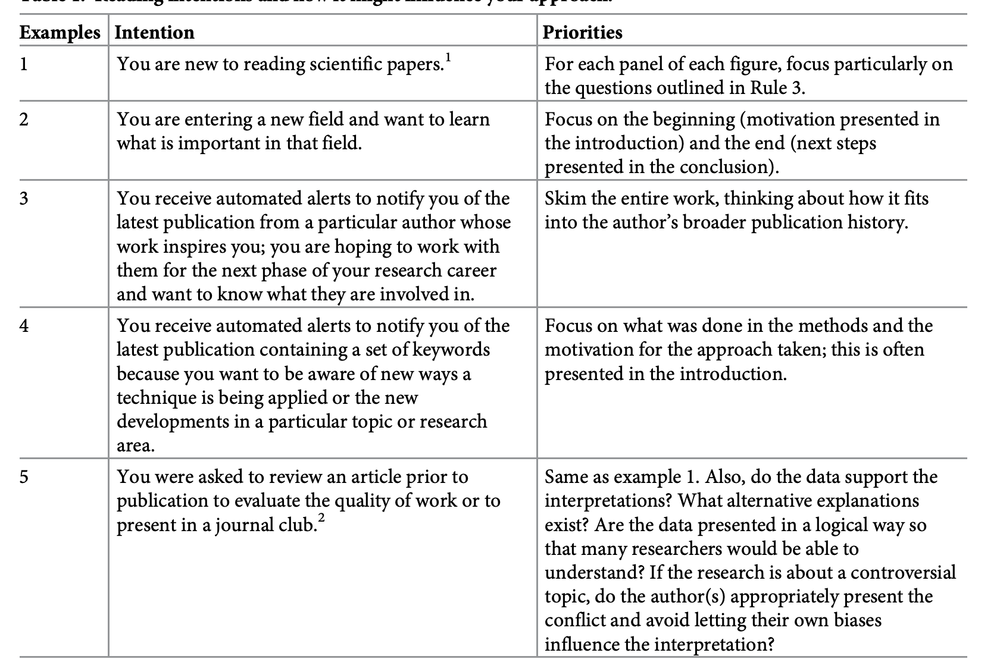

Hello, this is my personal note in the time I am working at Computational Disease Biology Lab under the supervision of Professor Rachel Melamed.
### The importance of stupidity in scientific research
It's okay to feel dumb. When you have a feeling that you are stupid in a particular thing, it mean you did it with 100% of your effort.
### Ten simple rules for reading a scientific paper
There is 10 rules for reading a scientific paper:\
**1: Pick your goal**\
Why should I read this paper, there is a table that list the things we should priority depence on the reason that we read the paper. 

**2: Understand the author's goal**\
Try to identify the author, who are they? What are they interested? Is the topic of the paper related with their interested?\
Ask more question, what kind of aricle is this? What is the journal?\
**3: Ask questions**\
Need to ask myself
1. what do they want to motivate?
2. how did they approach it? why they pick this way?
4. what is the results? How the author explain it?
5. what should be done next?\

**4: Analyse the figure and table**\
Try to understand the figures and tables. Like what is it presenting? What is the meaning of the x or y axis? What is the data meaning?\
**5: Understand of the formatting**\

**6: Be critical**\
Consider the content of the paper you read? It might be not 100% true.
It is a tough skill to learn as well.
**7: Be kind**\
Don't let the minor error your evaluation and interpretation of the work. 
Some people take years to publish a paper and hearing a rude, brusque, or mean-spirited
critique can be heartbreaking, especially for young scientists or those seeking to establish their place within a field and who may worry that they do not belong \
**8: Go more than that**\
Read the citation articles. Read without any pressure for the first time and try to completely understand the paper for the couple next time. \
**9: Discuss about the paper**\
Talk about it with your peers, mentors,... it will solidfy your understanding \
**10: Build on it**\
Try to do your work to improve it
### My note in the PrediXcan paper
<iframe src="Paper_note.pdf" width="100%" height="600px" style="border: none;">
  This browser does not support PDFs. Please download the PDF to view it: 
  <a href="Paper_note">Download PDF</a>.
</iframe>